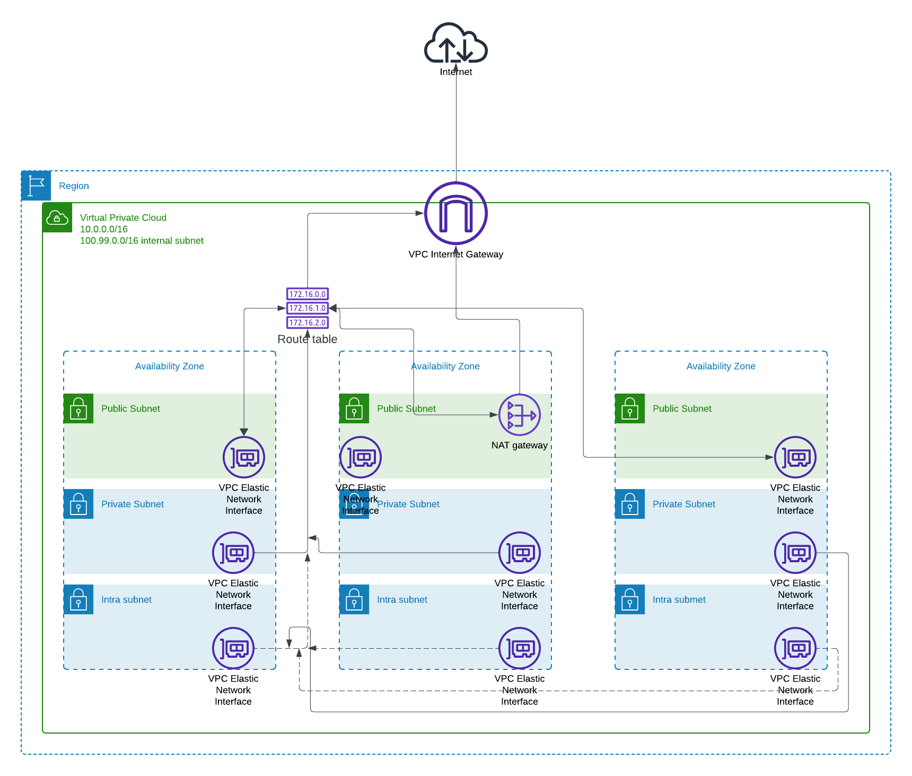

# EKS and Network Architecture Documentation

This document provides a comprehensive explanation of the network and EKS architecture used to deploy a Node.js application on AWS EKS. The design ensures high availability, security, scalability, and cost efficiency, adhering to best practices.

## 1. Network Architecture Overview

The network architecture leverages a **Virtual Private Cloud (VPC)** that spans multiple Availability Zones (AZs). This ensures fault tolerance, scalability, and a logical separation of resources. The architecture isolates internet-facing resources from internal components using both **public** and **private subnets**.

### VPC Design:

***NETWORK ARCHITECTURE DIAGRAM***

The VPC is configured with two CIDR ranges:

- **10.0.0.0/16**: Main VPC, following RFC1918 private IP allocation.
- **100.99.0.0/16**: An additional non-RFC1918 internal subnet for flexibility in network design.

### Subnet Configuration:

Each Availability Zone contains three types of subnets to serve different workloads:

1. **Public Subnets**: Host internet-facing components such as NAT Gateways and Elastic Load Balancers. These subnets have a route to the internet through an Internet Gateway.
2. **Private Subnets**: Host the EKS worker nodes and other internal application components. These subnets do not have direct internet access and instead route outgoing traffic through a NAT Gateway for security.
3. **Intra Subnets**: Designed for workloads that require no internet access. All traffic in and out of these subnets stays within the VPC, enhancing security for sensitive operations.

### Routing and NAT Gateway:

To ensure secure internet access for internal components:

- **Public subnets** have routing tables that allow direct internet access via the Internet Gateway.
- **Private subnets** send outbound traffic through a **NAT Gateway** placed in a public subnet, allowing them to communicate with external services (e.g., package downloads) without being exposed to inbound internet traffic.
- **Intra subnets** are isolated from the internet entirely and use only VPC-internal communication.

The **NAT Gateway** provides high availability by deploying across multiple AZs. This ensures failover and redundancy in case of AZ-specific outages.

### VPC Endpoints:

To reduce exposure to the public internet and improve security, **VPC Endpoints** are used for private communication with AWS services such as **Amazon S3**, **Amazon ECR**, and **AWS STS**. The endpoints leverage private IP addresses and security groups to restrict access, ensuring no public internet is involved.

Endpoints used:

- **S3 Gateway Endpoint**: For efficient and secure storage access.
- **Interface Endpoints** for ECR and STS to pull Docker images and manage service authentication without public traffic.

---

## 2. EKS Architecture Overview

The **Amazon Elastic Kubernetes Service (EKS)** architecture provides a fully managed Kubernetes environment spread across multiple AZs, ensuring resilience, scalability, and high availability.

***EKS ARCHITECTURE DIAGRAM:***

### EKS Control Plane:

- **AWS Managed Control Plane**: The Kubernetes control plane is managed by AWS, reducing operational overhead. It is highly available and distributed across multiple AZs.
- The control plane communicates with AWS services like **S3**, **ECR**, and **STS** using **VPC Endpoints**, ensuring that data stays within the AWS network and never traverses the public internet.

### Worker Nodes (Compute):

- **Private Subnets for Worker Nodes**: All worker nodes (whether EC2 instances or Fargate tasks) are deployed in private subnets, preventing direct internet exposure.
- **Auto Scaling Group**: The worker nodes are part of an Auto Scaling group that adjusts the node count based on the current resource requirements of the cluster. This ensures efficient use of resources and cost optimization.
- **Pod Networking**: Pods receive IP addresses from intra subnets, ensuring internal-only communication. The **VPC CNI Plugin** manages this networking setup.

### Pod Networking:

- **Elastic Network Interfaces (ENI)**: Each pod can receive an IP address from the private or intra subnet range, depending on the configuration. This ensures that pod-to-pod and pod-to-service communication stays internal to the VPC.
- **Custom Networking**: With **custom networking enabled**, the cluster optimizes IP address allocation by segregating pod traffic to specific subnets (intra subnets), preventing direct internet access by default.

### Addons:

The architecture includes several essential addons to enhance the functionality and performance of the EKS cluster. These addons provide load balancing, continuous deployment, and automated scaling to ensure the cluster operates efficiently and securely.

### 1. AWS Application Load Balancer (ALB):

  **AWS Application Load Balancer (ALB)** is dynamically provisioned by the **AWS ALB Ingress Controller**, which manages Kubernetes **Ingress** resources. The ALB is responsible for routing external traffic to the appropriate Kubernetes services running inside the EKS cluster.

- **Automatic Provisioning**: The ALB Ingress Controller listens for new or updated Ingress resources and automatically provisions ALBs as needed. This ensures seamless external access to services while maintaining load balancing across multiple Availability Zones.
  
- **Security Considerations**: 
  - The ALB operates in public subnets, and its security group restricts traffic to only the necessary ports (e.g., HTTP, HTTPS).
  - **SSL/TLS termination** is handled at the ALB to ensure that all traffic between clients and the load balancer is encrypted.
  - Backend services (Kubernetes Pods) can operate in **private subnets**, ensuring that they are not directly exposed to the internet.

- **Scaling**: ALB automatically scales based on traffic, distributing it across the services and availability zones, thus ensuring both high availability and fault tolerance.

  > **Security Groups**: The ALB is configured with security groups that limit the allowed incoming traffic, protecting the application from unauthorized access.

### 2. ArgoCD:

**ArgoCD** is a declarative, GitOps-based continuous deployment tool designed for Kubernetes. It automatically synchronizes the state of the Git repository with the live Kubernetes cluster, ensuring that the cluster reflects the desired state defined in the repository.

- **GitOps Workflow**: ArgoCD continuously monitors the Git repository for changes in application configurations, such as updates to Kubernetes manifests (e.g., `deployment.yaml`, `service.yaml`). When changes are detected, ArgoCD applies them to the EKS cluster, ensuring fully automated and traceable deployments.

- **Security Considerations**:
  - ArgoCD is integrated with **OpenID Connect (OIDC)** and **AWS IAM** roles for secure authentication and authorization. This ensures secure access to the Kubernetes API without relying on static credentials.
  - Access to the ArgoCD web UI and API is restricted through **Kubernetes Role-Based Access Control (RBAC)** policies, ensuring that only authorized users can deploy or manage applications.
  
- **Self-Healing**: In case of accidental or unauthorized changes in the cluster (manual changes outside GitOps), ArgoCD automatically reverts the state to match the Git repository, maintaining security and consistency.

### 3. Cluster Autoscaler:

The **Cluster Autoscaler** is a critical component for managing the compute capacity of the EKS cluster. It automatically adjusts the number of worker nodes (EC2 instances) based on the resource demands of the workloads running in the cluster.

- **How It Works**: 
  - The Cluster Autoscaler watches for pods that are pending due to insufficient resources (e.g., CPU or memory). If it detects that the cluster is under-provisioned, it scales up by adding more worker nodes.
  - Similarly, when there are underutilized nodes, the Cluster Autoscaler reduces the number of nodes to save costs, ensuring efficient use of resources.

- **Security Considerations**:
  - The autoscaler only operates on worker nodes within **private subnets**, ensuring that newly created nodes are not exposed to the public internet.
  - The scaling actions are managed using **IAM roles** that limit the autoscaler’s ability to modify only the necessary resources, minimizing the risk of privilege escalation.
  
- **Integration with Auto Scaling Group**: The autoscaler adjusts the size of the **Auto Scaling Group (ASG)** dynamically based on cluster needs. This ensures that the number of nodes in the cluster can grow or shrink without manual intervention.

- **Pod Priority and Preemption**: When the cluster is running out of resources, the autoscaler respects **Pod Priority** settings, ensuring that critical workloads get scheduled first.

These addons **AWS ALB controller, ArgoCD, and the Cluster Autoscaler** form an essential part of the EKS architecture. They enable automated scaling, secure application deployment, and efficient resource management, all while maintaining high availability and security.

## 3. Security Considerations

The entire architecture incorporates multiple security layers, leveraging AWS best practices to safeguard the infrastructure:

### Network Security:

- **Private Subnets for Worker Nodes**: Worker nodes are isolated in private subnets, making them inaccessible directly from the internet. All outbound traffic goes through the NAT Gateway, protecting internal components.
- **Security Groups**: All components (e.g., worker nodes, ALBs, VPC Endpoints) have tightly defined security groups to control inbound and outbound traffic.
- **VPC Endpoints**: By utilizing VPC Endpoints for AWS services (e.g., S3, ECR, STS), the architecture avoids sending traffic over the public internet, minimizing attack vectors.
  
### Identity and Access Management:

- **OIDC Authentication**: Secure integration between GitHub Actions and AWS through **OIDC** (OpenID Connect) ensures that no long-term credentials are stored or shared. This reduces the risk of credentials leakage.
- **IAM Roles for Service Accounts (IRSA)**: Kubernetes service accounts use **IAM Roles** to securely access AWS resources. This avoids embedding credentials in application containers.

### Pod Security:

- **Pod Security Policies (PSP)** and **Network Policies**: Enforced to control the security posture of individual pods, limiting which pods can communicate with others and restricting privilege escalation within containers.

### Data Encryption:

- **Encryption at Rest**: EKS integrates with AWS services to provide encryption for data at rest using AWS Key Management Service (KMS).
- **Encryption in Transit**: All data in transit, especially between worker nodes, control plane, and AWS services, is encrypted using TLS.

## 4. CI/CD Pipeline Design

The **CI/CD pipeline** is managed using **GitHub Actions** and integrates with **ArgoCD** for automated deployment.

### Pipeline Breakdown:

1. **Terraform Plan and Validate (PR)**:
   - Triggered on pull requests to the infrastructure repository.
   - Runs `terraform plan` to validate and show the proposed infrastructure changes without applying them.
   
2. **EKS Cluster Deployment (Merge)**:
   - Triggered on merging a pull request.
   - Deploys or updates the VPC, EKS cluster, and necessary infrastructure using **Terraform**.

3. **Docker Build and Push (Release Branch)**:
   - Builds the Docker image for the Node.js application and pushes it to **Amazon ECR**.
   - Updates the Kubernetes `deployment.yaml` with the new image version, pushing the changes to the release branch.

**ArgoCD** will automatically sync with the Git repository and apply the updated deployment configuration to the cluster.

---

This architecture provides a robust, secure, and scalable environment for running containerized applications on AWS. It leverages best practices in both network and Kubernetes security, while ensuring efficient and automated continuous delivery of updates.
